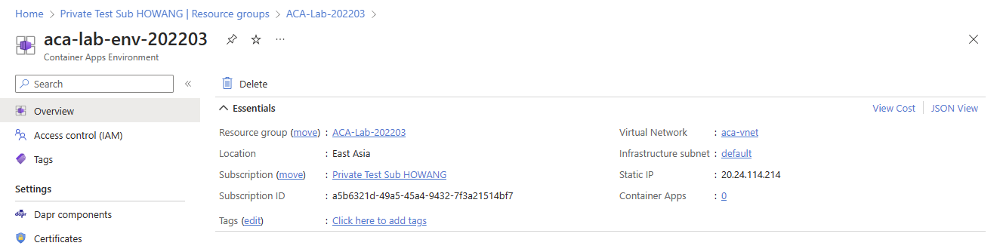
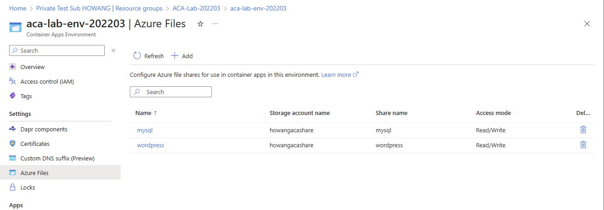
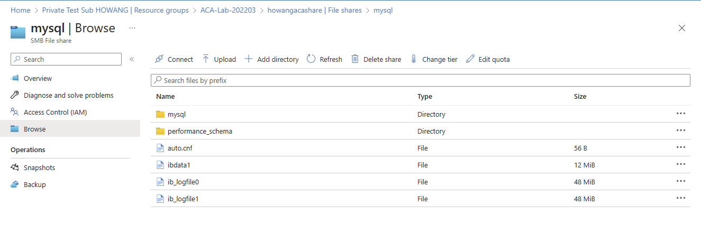
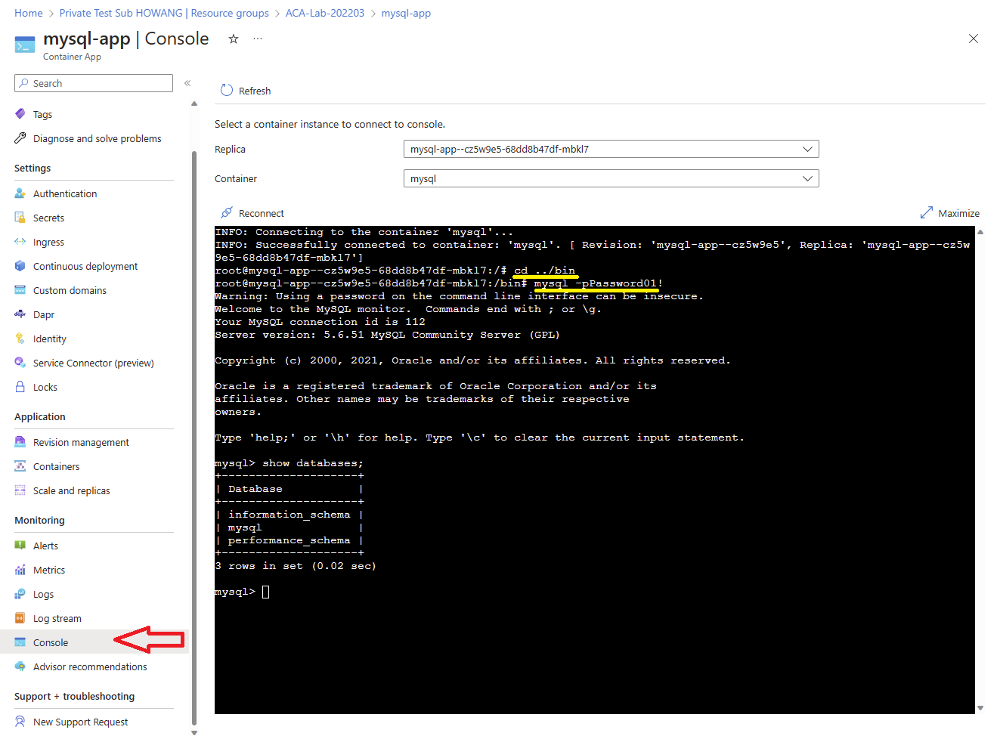
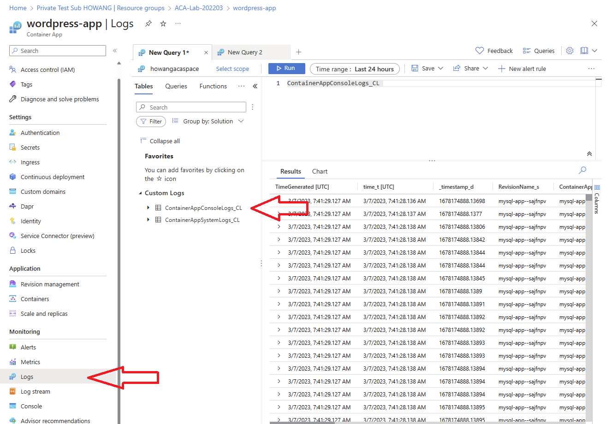

# Azure Container Apps 

## Prerequisites
- Install the [Azure CLI](https://learn.microsoft.com/en-us/cli/azure/install-azure-cli), and login to your subscription
```bash
az login
az account set --subscription <your subscription id> 
```
- Install the Azure Container App CLI Extension
```bash
az extension add --name containerapp --upgrade
```
- Register the Microsoft.App namespaces if you haven't already registered them in your Azure subscription.
```bash
az provider register --namespace Microsoft.App
```

## Setup

1.	Define the following variables in your bash shell.
```bash
RESOURCE_GROUP="ACA-Lab-202203"
LOCATION="eastasia"
ENVIRONMENT="aca-lab-env-202203"
STORAGE_ACCOUNT="howangacashare"
LOG_WORKSPACE="howangacaspace"
```
2.	Create the related resource
```bash
az group create --name $RESOURCE_GROUP --location $LOCATION
```

Create storage account will be used for persistent storage for MySQL and Wordpress
```bash
az storage account create --name $STORAGE_ACCOUNT --resource-group $RESOURCE_GROUP --location $LOCATION --sku Standard_LRS
az storage share create --account-name $STORAGE_ACCOUNT --name mysql
az storage share create --account-name $STORAGE_ACCOUNT --name wordpress
```

Create log analytics workspace for Azure Container Apps logging
```bash
az monitor log-analytics workspace create -g $RESOURCE_GROUP --workspace-name $LOG_WORKSPACE
```

Create Virtual Network for Azure Container Apps
```bash
az network vnet create -l $LOCATION -g $RESOURCE_GROUP -n aca-vnet --address-prefix 10.240.0.0/16 --subnet-name "default" --subnet-prefix 10.240.0.0/16
```

## Create Container App Environment

Run the following command to create Container App Environment
```bash
LogAnalyticsWorkspaceId=$(az monitor log-analytics workspace show -g $RESOURCE_GROUP --workspace-name $LOG_WORKSPACE --query customerId --output tsv) # This will be use in other steps

LogAnalyticsWorkspaceKey=$(az monitor log-analytics workspace get-shared-keys -g $RESOURCE_GROUP --workspace-name $LOG_WORKSPACE --query primarySharedKey --output tsv) # This will be use in other steps

SubnetId=$(az network vnet subnet list -g $RESOURCE_GROUP --vnet-name aca-vnet --query "[0].id" --output tsv) # This will be use in other steps

az containerapp env create --name $ENVIRONMENT -g $RESOURCE_GROUP -l $LOCATION --logs-workspace-id $LogAnalyticsWorkspaceId --logs-workspace-key $LogAnalyticsWorkspaceKey --infrastructure-subnet-resource-id $SubnetId
```

You should see the Environment get created in the Portal as below in the Portal


Link the Storage Account to the Environment
```bash
AccountKey=$(az storage account keys list --account-name $STORAGE_ACCOUNT --query [0].value --output tsv)

az containerapp env storage set -g $RESOURCE_GROUP --name $ENVIRONMENT --storage-name mysql --access-mode ReadWrite --account-name $STORAGE_ACCOUNT --azure-file-account-key $AccountKey --azure-file-share-name mysql

az containerapp env storage set -g $RESOURCE_GROUP --name $ENVIRONMENT --storage-name wordpress --access-mode ReadWrite --account-name $STORAGE_ACCOUNT --azure-file-account-key $AccountKey --azure-file-share-name wordpress
```

You should see the Storage get created under Environment as below in the Portal 



## Create MySQL

Now you are ready to create a Container Apps for MySQL. However, before it you need to get the `ManagedEnvironmentId` by the following command and replace to the YAML file.

Unlike the a normal web application, MySQL is a TCP application. You can tell the different from the Ingress section of the YAML.

```bash
az containerapp env show -g $RESOURCE_GROUP -n $ENVIRONMENT --query id

# You should see the output like "/subscriptions/a5b6321d-49a5-45a4-9432-7f3a21514bf7/resourceGroups/ACA-Lab-202203/providers/Microsoft.App/managedEnvironments/aca-lab-env-202203"
```

```yaml
# Save the content below to mysql-001.yaml file in local
# NOTE: The ManagedEnvironmentId need to replace by the value in previous step.

properties:
  managedEnvironmentId: <Replace with the ManagedEnvironment ID>
  configuration:
    secrets:
      - name: password
        value: Password01! # Replace with a strong password
    activeRevisionsMode: Single
    ingress:
      external: true
      targetPort: 3306
      exposePort: 3306
      traffic:
        - latestRevision: true
          weight: 100
      transport: Tcp
      allowInsecure: false
  template:
    containers:
      - image: docker.io/mysql:5.6
        name: mysql
        env:
          - name: MYSQL_ROOT_PASSWORD
            secretRef: password
        resources:
          cpu: 2
          memory: 4Gi
        volumeMounts:
          - volumeName: mysqldata
            mountPath: /var/lib/mysql
    scale:
      minReplicas: 1
      maxReplicas: 1  # It is important to set the max replica to 1 here.
    volumes:
      - name: mysqldata
        storageType: AzureFile
        storageName: mysql
```

Run the following command to create the container app

```bash
az containerapp create -n mysql-app -g $RESOURCE_GROUP --environment $ENVIRONMENT --yaml mysql-001.yaml
```

You should see the MySQL Data is created in the File Share we created previously.



You can use the Console to login to your MySQL container and run the debug command for troubleshooting too.



## Create WordPress

Now you are ready to create a Container Apps for WordPress. However, before it you need to get the `ManagedEnvironmentId` by the following command and replace to the YAML file.

```bash
az containerapp env show -g $RESOURCE_GROUP -n $ENVIRONMENT --query id

# You should see the output like "/subscriptions/a5b6321d-49a5-45a4-9432-7f3a21514bf7/resourceGroups/ACA-Lab-202203/providers/Microsoft.App/managedEnvironments/aca-lab-env-202203"
```


```yaml
# Save the content below to wordpress-001.yaml file in local
# NOTE: The ManagedEnvironmentId need to replace by the value in previous step.

properties:
  managedEnvironmentId: <Replace with the ManagedEnvironment ID>
  configuration:
    secrets:
      - name: password
        value: Password01! # Replace with a strong password  
    activeRevisionsMode: Single
    ingress:
      external: true
      allowInsecure: false
      targetPort: 80
      traffic:
        - latestRevision: true
          weight: 100
      transport: Auto
  template:
    containers:
      - image: docker.io/wordpress:4.8-apache
        name: wordpress
        env:
          - name: WORDPRESS_DB_HOST
            value: mysql-app # This is the app name of your MySQL
          - name: WORDPRESS_DB_PASSWORD
            secretRef: password
        resources:
          cpu: 0.5
          memory: 1Gi
        volumeMounts:
          - volumeName: wordpressdata
            mountPath: /var/www/html
    scale:
      minReplicas: 1
      maxReplicas: 3
    volumes:
      - name: wordpressdata
        storageType: AzureFile
        storageName: wordpress   
```

Run the following command to create the container app

```bash
az containerapp create -n wordpress-app -g $RESOURCE_GROUP --environment $ENVIRONMENT --yaml wordpress-001.yaml
```

You can view the application log in the log analytics workspace.

